### Bounded Contexts

1. **User Management Context**
   - Responsibility: Managing user registration, authentication, and account lifecycle for both tenants and property owners.
   - Core Concepts: User, Account, AuthenticationToken, PasswordResetToken.

2. **Tenant Profile Context**
   - Responsibility: Creating, managing, and verifying tenant profiles that property owners can browse.
   - Core Concepts: TenantProfile, VerificationDocument, VerificationStatus.

3. **Property Context**
   - Responsibility: Managing property listings, availability, and basic property information.
   - Core Concepts: Property, PropertyAddress, PropertyFeatures.

4. **Matching Context**
   - Responsibility: AI-powered matching algorithm connecting property owners with ideal tenants.
   - Core Concepts: Match, MatchingCriteria, MatchScore.

5. **Rental Agreement Context**
   - Responsibility: Managing lease agreements, terms, and contract lifecycle.
   - Core Concepts: RentalAgreement, LeaseTerm, ContractStatus.

6. **Payment Context**
   - Responsibility: Processing payments, managing billing, and financial transactions.
   - Core Concepts: Payment, PaymentMethod, Transaction.

### User Management Context

#### User Aggregate
- **Root Entity**: User
  - Attributes: userId, email, hashedPassword, accountType (Tenant/PropertyOwner), accountStatus, createdDate
  - Invariants: Email must be unique, password must meet security criteria, accountType must be valid

- **Value Object**: EmailAddress
  - Attributes: value
  - Behavior: validate(), normalize()

- **Value Object**: Password
  - Attributes: value
  - Behavior: hash(), validateStrength()

- **Entity**: Account
  - Attributes: accountId, userId, accountStatus, lastLoginDate
  - Behavior: activate(), deactivate(), suspend()

#### Domain Events
- UserRegistered: Triggered when a new user is created
- PasswordChanged: Triggered when user changes password
- AccountActivated: Triggered when user account is activated
- AccountDeactivated: Triggered when user account is deactivated

#### Commands
- RegisterUser: Creates a new user account
- ChangePassword: Updates user's password
- ActivateAccount: Activates a user account
- DeactivateAccount: Deactivates a user account
- RequestPasswordReset: Initiates password reset process

### Tenant Profile Context

#### TenantProfile Aggregate
- **Root Entity**: TenantProfile
  - Attributes: profileId, userId, profileStatus, createdDate, lastUpdatedDate
  - Invariants: Must be associated with valid User, required fields must be completed

- **Entity**: PersonalInformation
  - Attributes: firstName, lastName, dateOfBirth, phoneNumber
  - Behavior: update()

- **Value Object**: VerificationStatus
  - Attributes: status (NotVerified/Pending/Verified/Rejected), verificationDate, rejectionReason
  - Behavior: updateStatus()

- **Entity**: VerificationDocument
  - Attributes: documentId, documentType, documentUrl, uploadDate, verificationStatus
  - Behavior: upload(), verify(), reject()

#### Domain Events
- ProfileCreated: Triggered when a new tenant profile is created
- ProfileUpdated: Triggered when tenant profile information is updated
- VerificationRequested: Triggered when tenant requests identity verification
- VerificationCompleted: Triggered when tenant verification process is completed
- VerificationRejected: Triggered when tenant verification is rejected

#### Commands
- CreateProfile: Creates a new tenant profile
- UpdateProfile: Updates existing tenant profile
- RequestVerification: Initiates identity verification process
- SubmitVerificationDocument: Submits document for verification
- ApproveVerification: Approves tenant verification
- RejectVerification: Rejects tenant verification

### Property Context

#### Property Aggregate
- **Root Entity**: Property
  - Attributes: propertyId, ownerId, title, description, propertyStatus, createdDate
  - Invariants: Must be associated with valid Property Owner, required fields must be completed

- **Value Object**: PropertyAddress
  - Attributes: street, city, state, postalCode, country
  - Behavior: validate(), format()

- **Entity**: PropertyFeatures
  - Attributes: featureId, name, value
  - Behavior: add(), remove(), update()

- **Value Object**: Availability
  - Attributes: startDate, endDate, status (Available/Reserved/Rented)
  - Behavior: updateStatus()

#### Domain Events
- PropertyAdded: Triggered when a new property is added
- PropertyUpdated: Triggered when property information is updated
- PropertyAvailabilityChanged: Triggered when property availability changes

#### Commands
- AddProperty: Adds a new property listing
- UpdateProperty: Updates existing property information
- UpdatePropertyAvailability: Changes property availability status

### Matching Context

#### Match Aggregate
- **Root Entity**: Match
  - Attributes: matchId, profileId, propertyId, matchScore, matchStatus, createdDate
  - Invariants: Must be associated with valid TenantProfile and Property, matchScore must be calculated

- **Entity**: MatchingCriteria
  - Attributes: criteriaId, name, weight, value
  - Behavior: updateWeight(), updateValue()

- **Value Object**: MatchScore
  - Attributes: score, confidenceLevel
  - Behavior: calculate(), validate()

#### Domain Events
- MatchCreated: Triggered when a new match is created
- MatchScoreUpdated: Triggered when match score is recalculated
- MatchAccepted: Triggered when a match is accepted by both parties
- MatchRejected: Triggered when a match is rejected by either party

#### Commands
- CalculateMatch: Calculates match between tenant profile and property
- UpdateMatchScore: Updates match score based on new criteria
- AcceptMatch: Accepts a match
- RejectMatch: Rejects a match

### Rental Agreement Context

#### RentalAgreement Aggregate
- **Root Entity**: RentalAgreement
  - Attributes: agreementId, matchId, tenantId, ownerId, propertyId, startDate, endDate, rentAmount, status, createdDate
  - Invariants: Must be associated with valid Match, dates must be valid, rent amount must be positive

- **Value Object**: LeaseTerm
  - Attributes: startDate, endDate, duration, autoRenewal
  - Behavior: validate(), extend()

- **Entity**: AgreementClause
  - Attributes: clauseId, title, content, required
  - Behavior: add(), remove(), update()

- **Value Object**: AgreementStatus
  - Attributes: status (Draft/Pending/Active/Terminated/Expired), lastUpdatedDate
  - Behavior: updateStatus()

#### Domain Events
- AgreementCreated: Triggered when a new rental agreement is created
- AgreementSigned: Triggered when rental agreement is signed by all parties
- AgreementActivated: Triggered when rental agreement becomes active
- AgreementTerminated: Triggered when rental agreement is terminated
- AgreementExpired: Triggered when rental agreement expires

#### Commands
- CreateAgreement: Creates a new rental agreement
- SignAgreement: Signs a rental agreement
- ActivateAgreement: Activates a rental agreement
- TerminateAgreement: Terminates a rental agreement
- ExtendAgreement: Extends rental agreement term

### Payment Context

#### Payment Aggregate
- **Root Entity**: Payment
  - Attributes: paymentId, agreementId, amount, paymentDate, paymentStatus, paymentMethod
  - Invariants: Must be associated with valid RentalAgreement, amount must be positive

- **Value Object**: PaymentMethod
  - Attributes: type (CreditCard/PayPal/BankTransfer), details
  - Behavior: validate(), encrypt()

- **Entity**: Transaction
  - Attributes: transactionId, paymentId, amount, transactionDate, status
  - Behavior: process(), refund(), cancel()

- **Value Object**: PaymentStatus
  - Attributes: status (Pending/Completed/Failed/Refunded), lastUpdatedDate
  - Behavior: updateStatus()

#### Domain Events
- PaymentInitiated: Triggered when a payment is initiated
- PaymentCompleted: Triggered when a payment is successfully completed
- PaymentFailed: Triggered when a payment fails
- PaymentRefunded: Triggered when a payment is refunded

#### Commands
- InitiatePayment: Initiates a new payment
- ProcessPayment: Processes a pending payment
- RefundPayment: Refunds a completed payment
- CancelPayment: Cancels a pending payment

### Inter-Context Communication Strategy

#### User Management Context ↔ Tenant Profile Context
- **Pattern**: Shared Kernel
- **Justification**: Both contexts need access to the core User concept. A Shared Kernel for the User entity ensures consistency and avoids duplication of user identity across the system.

#### User Management Context ↔ Property Context
- **Pattern**: Shared Kernel
- **Justification**: Similar to the Tenant Profile Context, the Property Context requires access to the User concept for property owners. Using the same Shared Kernel maintains consistency.

#### Tenant Profile Context → Matching Context
- **Pattern**: Open Host Service / Published Language
- **Justification**: Tenant Profile Context provides tenant information to the Matching Context. Using an Open Host Service allows the Tenant Profile Context to define a clear API for accessing tenant profile information, which the Matching Context can consume.

#### Property Context → Matching Context
- **Pattern**: Open Host Service / Published Language
- **Justification**: Similar to the Tenant Profile Context, the Property Context provides property information to the Matching Context. Using an Open Host Service provides a clear API for accessing property information.

#### Matching Context → Rental Agreement Context
- **Pattern**: Open Host Service / Published Language
- **Justification**: The Matching Context provides match information to the Rental Agreement Context. Using an Open Host Service allows the Matching Context to define a clear API for match information.

#### Rental Agreement Context → Payment Context
- **Pattern**: Customer-Supplier
- **Justification**: The Rental Agreement Context is the customer of the Payment Context. This relationship is well-defined, and the Payment Context provides specific services to meet the needs of the Rental Agreement Context.

#### Rental Agreement Context ↔ User Management Context
- **Pattern**: Anti-Corruption Layer (ACL)
- **Justification**: The Rental Agreement Context needs to access User information but has different concerns than the User Management Context. An ACL protects the Rental Agreement Context from changes in the User Management Context and translates between the two contexts' models.

#### All Contexts ↔ User Management Context (for notifications)
- **Pattern**: Event-Driven Architecture
- **Justification**: All contexts need to react to user account changes (creation, deactivation). Using domain events allows for loose coupling and ensures that all relevant contexts are notified of important changes.

### Domain Model Visualization

```mermaid
graph TB
    subgraph "Shared Kernel"
        SK_User[User Entity]
    end

    subgraph "User Management Context"
        UMC_UserManagement["User Management Context"]
        UMC_UserAggregate[User Aggregate]
        UMC_Account[Account Entity]
        UMC_EmailAddress[EmailAddress VO]
        UMC_Password[Password VO]
    end

    subgraph "Tenant Profile Context"
        TPC_TenantProfile["Tenant Profile Context"]
        TPC_TenantProfileAggregate[TenantProfile Aggregate]
        TPC_PersonalInformation[PersonalInformation Entity]
        TPC_VerificationStatus[VerificationStatus VO]
        TPC_VerificationDocument[VerificationDocument Entity]
    end

    subgraph "Property Context"
        PC_Property["Property Context"]
        PC_PropertyAggregate[Property Aggregate]
        PC_PropertyAddress[PropertyAddress VO]
        PC_PropertyFeatures[PropertyFeatures Entity]
        PC_Availability[Availability VO]
    end

    subgraph "Matching Context"
        MC_Matching["Matching Context"]
        MC_MatchAggregate[Match Aggregate]
        MC_MatchingCriteria[MatchingCriteria Entity]
        MC_MatchScore[MatchScore VO]
    end

    subgraph "Rental Agreement Context"
        RAC_RentalAgreement["Rental Agreement Context"]
        RAC_RentalAgreementAggregate[RentalAgreement Aggregate]
        RAC_LeaseTerm[LeaseTerm VO]
        RAC_AgreementClause[AgreementClause Entity]
        RAC_AgreementStatus[AgreementStatus VO]
    end

    subgraph "Payment Context"
        PC_Payment["Payment Context"]
        PC_PaymentAggregate[Payment Aggregate]
        PC_PaymentMethod[PaymentMethod VO]
        PC_Transaction[Transaction Entity]
        PC_PaymentStatus[PaymentStatus VO]
    end

    %% Shared Kernel relationships
    SK_User -- Shared Kernel --> UMC_UserAggregate
    SK_User -- Shared Kernel --> TPC_TenantProfileAggregate
    SK_User -- Shared Kernel --> PC_PropertyAggregate

    %% Open Host Service relationships
    TPC_TenantProfile -- Open Host --> MC_Matching
    PC_Property -- Open Host --> MC_Matching
    MC_Matching -- Open Host --> RAC_RentalAgreement

    %% Customer-Supplier relationship
    RAC_RentalAgreement -- Customer-Supplier --> PC_Payment

    %% ACL relationship
    RAC_RentalAgreement -- ACL --> UMC_UserManagement

    %% Event-driven relationships
    UMC_UserManagement -. Domain Events .-> TPC_TenantProfile
    UMC_UserManagement -. Domain Events .-> PC_Property
    UMC_UserManagement -. Domain Events .-> RAC_RentalAgreement
    TPC_TenantProfile -. Domain Events .-> MC_Matching
    PC_Property -. Domain Events .-> MC_Matching
    MC_Matching -. Domain Events .-> RAC_RentalAgreement
    RAC_RentalAgreement -. Domain Events .-> PC_Payment
    PC_Payment -. Domain Events .-> RAC_RentalAgreement

    %% Style
    classDef context fill:#f9f,stroke:#333,stroke-width:2px;
    classDef aggregate fill:#bbf,stroke:#333,stroke-width:2px;
    classDef entity fill:#bfb,stroke:#333,stroke-width:2px;
    classDef vo fill:#fbb,stroke:#333,stroke-width:2px;
    
    class UMC_UserManagement,TPC_TenantProfile,PC_Property,MC_Matching,RAC_RentalAgreement,PC_Payment context;
    class UMC_UserAggregate,TPC_TenantProfileAggregate,PC_PropertyAggregate,MC_MatchAggregate,RAC_RentalAgreementAggregate,PC_PaymentAggregate aggregate;
    class UMC_Account,TPC_PersonalInformation,TPC_VerificationDocument,PC_PropertyFeatures,MC_MatchingCriteria,RAC_AgreementClause,PC_Transaction entity;
    class UMC_EmailAddress,UMC_Password,TPC_VerificationStatus,PC_PropertyAddress,PC_Availability,MC_MatchScore,RAC_LeaseTerm,RAC_AgreementStatus,PC_PaymentMethod,PC_PaymentStatus vo;
```

